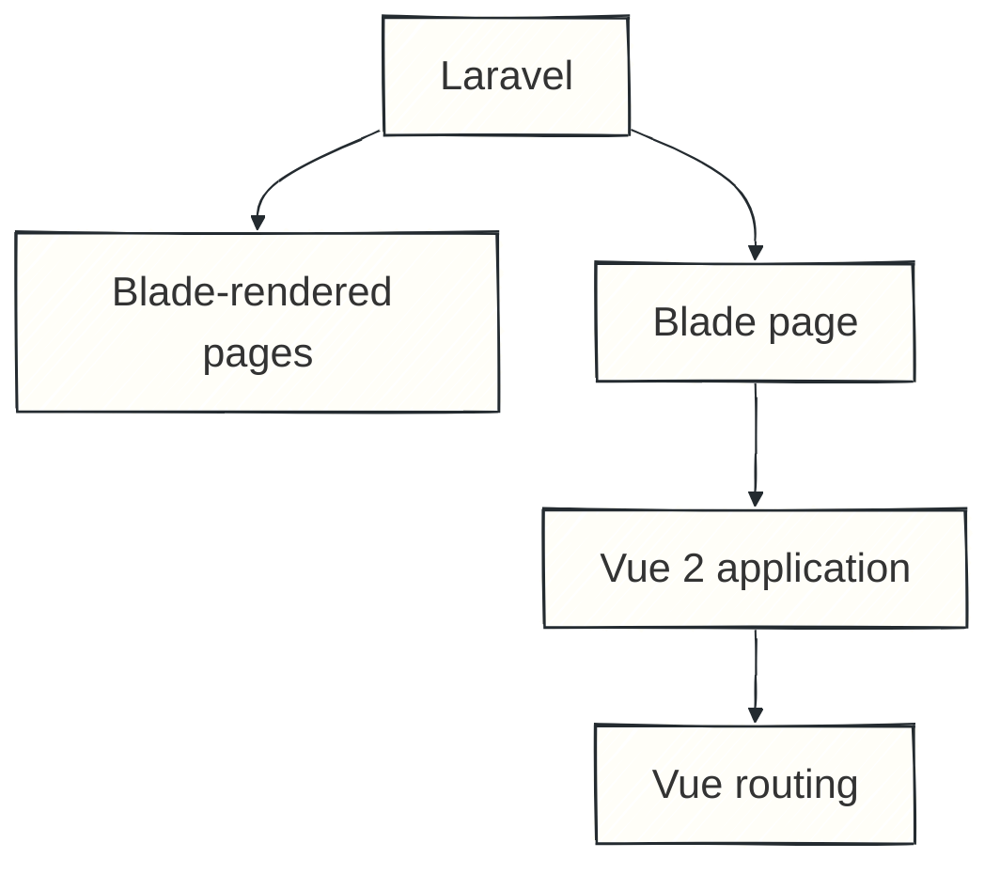
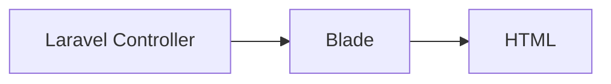
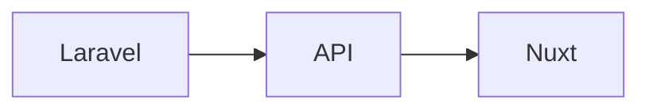
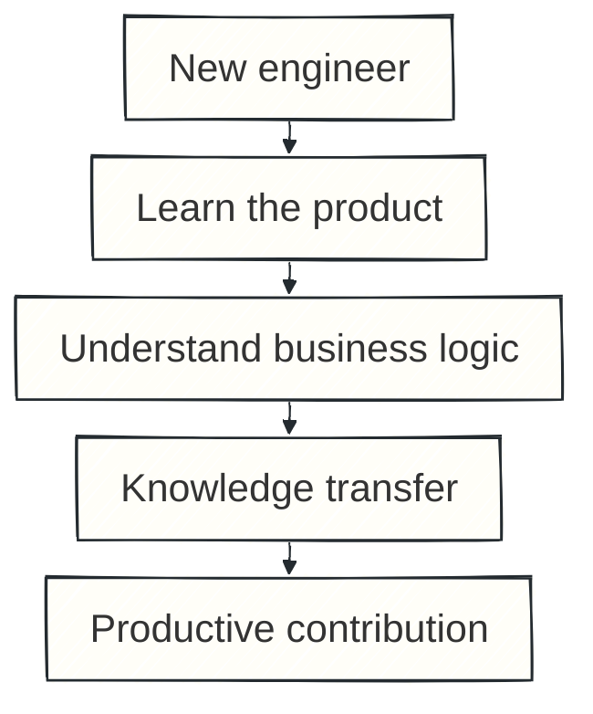
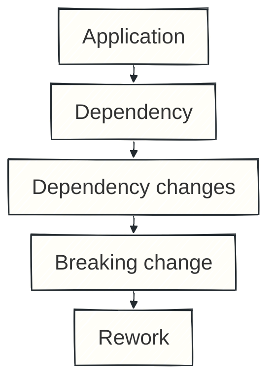

A real-world rewrite

# The Not-So-Straight Story

### A story about rewriting an app from scratch

  Andreas Panopoulos · Staff Engineer @ HackTheBox

<!--
Hello everyone. 

Today I want to share a real story about rewriting an entire application.
We moved from a hybrid Laravel Blade and Vue 2 application to a new front end built with Nuxt.

This is not going to be very technical talk about Vue and Nuxt, or changing frameworks. 

It’s more about how we approached the rewrite, what didn’t go as we expected, and most importantly, what I would do differently if I had to do it again.
-->

---
layout: center
class: profile-slide
doodles: true
---

  

    
  

  

    
Hello, I'm

    
Andreas

    
Staff Engineer @HackTheBox

  

  Photography
  Music
  Books
   Movies
  Time with family

<!--
Before we start let me introduce my self.

I'm Andreas. I am Staff Engineer at HackTheBox.

Outside of engineering, I enjoy photography, music, books, movies, and spending time with my family.
-->

---
layout: two-cols
layoutClass: gap-12
---

# Where we started

## Two frontend worlds inside the same product.

<BoulitQuote v-click class="mt-8">Architecture decisions make sense in the context in which they were made</BoulitQuote>

::right::

<BoulitPaper>

</BoulitPaper>

<!--
Let’s start with the application we already had. 

It was a combination of Laravel and Vue 2. That’s why I like to call it a hybrid application. Some pages were rendered with Laravel Blade, while others were using Vue.

For the Vue 2 pages, what we did was render a Laravel Blade page, initialise Vue inside it, and from that point onwards Vue was handling the routing for that section.

I wouldn’t say this architecture was a bad decision, because it helped us grow the product and scale the platform.

We have to keep in mind that architecture decisions make sense in the context in which they were made. The issue is that applications change and requirements change too.
-->

---
layout: center
---

# Why change?

  
Vue 2 <strong>end of life</strong>

  
Frontend / backend <strong>separation</strong>

  
Consistent frontend <strong>architecture</strong>

  
Component <strong>reuse</strong>

  
Growing <strong>complexity</strong>

<!--
As the platform was getting bigger, and we also had more applications in the organization, the need for UI consistency became more important.

We wanted to be able to reuse components and functionality across our platforms, so we wouldn’t have to rewrite them every time.

At the same time, Vue 2 had reached end of life, so upgrading to Vue 3 became necessary.

We also wanted to clearly separate the front end from the back end.

Taking all of that into consideration, we decided that the best solution was to rewrite the application from scratch.
-->

---
layout: center
class: text-center
---

  Nuxt
  Vue 3
  TypeScript
  Pinia

# The technology choice was the easy part.

<!--
After deciding that we had to rewrite the application, the next question was: what stack were we going to use?

One thing we definitely wanted was an opinionated structure, so that any engineer joining the team in the future could get onboarded more easily and wouldn’t have to figure out where components go, where pages live, and so on.

Nuxt gave us that structure, along with some other useful things. It also has a great ecosystem and a lot of existing modules, so we could use some of them instead of building everything from scratch.

The second decision was to use TypeScript. We wanted a more type-safe solution, with better feedback while writing code, and a clearer understanding of the data we were handling.

Last but not least, we followed the direction of the Vue ecosystem and switched from Vuex to Pinia. What we liked about Pinia was that it allowed us to organise the state into smaller, focused stores.

So the new application would use Nuxt, TypeScript, and Pinia.
-->

---
layout: center
---

# It wasn't just a Vue migration

  

    
Before

  

  

    
After

  

The frontend rewrite also created backend work.

<!--
There was something very important about this rewrite. As I have already mentioned, some pages were rendered with Laravel Blade.

So there was no need to have API endpoints for those pages, because the Laravel controller was getting the data and rendering the Blade page with all the information we needed.

With Nuxt, things were different. We needed an API in order to get the data and display the page.

For that, we also needed help from the backend team, and that made the scope of the rewrite significantly bigger.

So this was not just a simple migration. We didn’t only have to rewrite some pages. We also had to create the way for the new frontend to fetch the data it needed.

So, in the end, this was not just a frontend rewrite.
-->

---
layout: center
class: text-center
---

The original plan

  
<strong>2</strong>frontend engineers

  
×

  
<strong>≈ 1</strong>year

  Build the new app
  ·
  Support the existing app
  ·
  Limit new legacy scope

<!--
Eventually came the question that always comes: how long is this going to take?

At that time, we were two front-end engineers working on the application, and our estimation was around one year.

But there was an important condition. During that year, we would not add new features to the legacy application. We would only maintain it, fix bugs, and stay mainly focused on the rewrite.

Of course, this was not an easy request, and not something that would be accepted immediately.

So we had to explain the reasoning behind it. Every new feature added to the legacy platform would also increase the scope of the rewrite, because we would have to build that feature again in the new application.

And in many cases, it was not something we could simply reuse. We had to rebuild it for the new platform.

So part of the work was not only technical. We also had to explain why we needed that one-year investment and how it would help us scale the product in the future.
-->

---
layout: two-cols
layoutClass: gap-16
---

# What if we add another engineer?

## More engineers ≠ proportionally less time

<BoulitQuote v-click class="mt-8">Putting two drivers in the front seat won't get the bus to its destination in half the time.</BoulitQuote>

::right::

<BoulitPaper>

</BoulitPaper>

<!--
Then the second question came up: if two engineers need one year, what happens if we add more engineers? Would that make the project significantly faster?

Of course, one of the reasons we chose Nuxt in the first place was to make future onboarding easier, because it gave us a clear structure and good documentation.

But even with that, any new engineers joining the team would still need time to understand the platform itself.

They would need to understand how the legacy platform worked and also learn the business logic of the product before they could recreate it in the new application.

During that onboarding period, the existing team could not stay fully focused on writing code, because they would also need to answer questions and help the new team members get onboarded.

And as the team gets bigger, there is also more communication overhead. More coordination, more code reviews, and more decisions about how we work together.

So adding more engineers does not automatically mean that the project will finish proportionally faster.

It’s a bit like putting more drivers in the front seat. It won’t make the bus reach its destination in half the time.
-->

---
layout: center
---

# Building the foundations

  
<b>01</b>Designs

  <i>→</i>
  
<b>02</b>Common components

  <i>→</i>
  
<b>03</b>Tests + Stories

  <i>→</i>
  
<b>04</b>Pages

  <i>→</i>
  
<b>05</b>Development environment

  The first month focused on reusable building blocks.

<!--
Then it was time to start building the application.

What we decided to do first was inspect the designs and identify the components that were being used across them, so we could create the base components that would structure the application.

For a little more than a month, we worked on creating those base components, along with their tests and stories.

The reason we added stories so early was to give visibility to the stakeholders. As I mentioned, we didn’t start by building complete pages. We started with the base components, so otherwise there wouldn’t be much to show.

Through the stories, stakeholders could see what we were building and follow the progress of the project.

Once we had the base components ready, we started building the actual pages and provided a development environment where the rest of the team and the stakeholders could test the application and follow its progress.
-->

---
layout: center
class: text-center
transition: fade
---

The estimate. The architecture. The foundations.

# Then the plan met reality.

<!--
And now we get to the part where the rewrite and our plans start meeting reality.

We had chosen the technology, we had estimated the work, we had set the foundations with the base components, and we had started building the pages.

But a rewrite doesn’t happen in an isolation. The environment around the project changes, and things that looked reasonable during planning start getting tested.

There wasn’t one single event that suddenly changed the project. It was several smaller things that started accumulating over time.
-->

---
layout: two-cols
layoutClass: gap-16
---

# Changing dependencies

## An unstable dependency is part of your project risk.

::right::

<BoulitPaper>

</BoulitPaper>

<!--
One of the challenges we faced was that some of the internal packages we were using to speed up our process were still evolving, and that introduced some breaking changes.

Of course, handling those changes affected both the scope and the timeline of the project.

A good lesson from that is to communicate this kind of risk as early as possible. Ideally, this should happen during the estimation phase. If the risk appears later, then communicate it as soon as you become aware of it, so everyone has enough time to decide how to handle it.
-->

---
layout: center
---

# The product doesn't stop

  <strong>LEGACY APPLICATION</strong>
  support<i>→</i>fixes<i>→</i>changes<i>→</i>still running

  <strong>NEW APPLICATION</strong>
  build<i>→</i>migrate<i>→</i>verify<i>→</i>release

The product you're replacing is a moving target.

<!--
Another big challenge we faced, and something we hadn’t really thought about during the planning and estimation phase, was how to introduce the new application to the users.

You cannot just replace the application suddenly one day. Users are still using the old one, and if they wake up one day in a completely different environment, they may feel lost or stressed.

We needed to give them some time to explore the new application and get familiar with it before completely replacing the old one. That way, we could also collect feedback about the new application, see what might be missing, and identify things that could be improved before the full transition.

So the challenge was: how can these two applications coexist under the same domain, and how can we make the transition from the old one to the new one as smooth as possible?

This is one of the challenges you have when you are rewriting an application that is already being used.
-->

---
layout: center
class: text-center
transition: fade
---

  
We knew the platform.

  
We thought we knew the platform.

  Your team's memory is not documentation.

<!--
And now we come to probably the most important challenge we faced, when reality really hits you.

We believed that we knew the platform. We had been working on it for a long time. We knew the features, we knew the business logic — or at least we thought we did.

But there is a big difference between knowing your application and having to rewrite everything from the start.

During the rewrite, we started finding things that we had forgotten, or things that we remembered differently from how they actually worked.

So in many cases, we had to go back to the old application, investigate the code, answer our questions, and then reproduce that behaviour in the new application.

And this was a very important lesson for us: you cannot do a rewrite from memory. You cannot rely only on what the team remembers.

You need clear documentation about the business logic and how things work in the application. After some time, nobody can remember every detail of every feature.

That information needs to be written somewhere and easy to find when questions come up. And it can also help new team members get onboarded much faster.
-->

---
layout: center
class: text-center
---

Original estimate

1 YEAR

↓

Actual release

1.5 YEARS

  Large scope
  Legacy support
  Backend work
  Onboarding
  Changing dependencies
  Evolving needs
  Missing documented knowledge

<!--
So, what happened to our one-year estimation? 

You guessed it,  we missed it.

The release eventually took around a year and a half.

I don’t think there was one single reason for that. The scope was large, there was a lot of coordination needed, and different parts of the organisation had to work together to make the release happen.

If you look at each of these things individually, they may not seem that big. But when all these small things start adding up, they can easily push your timeline away from what you originally estimated.

I wouldn’t necessarily say that missing a deadline is a failure, especially if the delay is not too big and you have communicated the risk early.

When you are working on a big project that needs coordination across different teams, it is very easy to add overhead to the whole process.

And of course, having too many unknowns doesn’t help.

So before starting, you should try to resolve as many unknowns as possible. New ones will always come up during the project, but if you are well prepared from the beginning, you will have fewer surprises to handle later.

And if the timeline needs to move, the important thing is to communicate it early and try to keep that delay under control.
-->

---
layout: center
---

# Communicate the risk early

  

    
Better path

    
Risk appears
<b>↓</b>
    
Communicate
<b>↓</b>
    
Adjust scope / priorities / expectations

  

  

    
Dangerous path

    
Risk appears
<b>↓</b>
    
Hope to recover
<b>↓</b>
    
Keep pushing
<b>↓</b>
    
Deadline arrives

  

Communicate the risk before it becomes a missed deadline.

<!--
When you start realizing that the original deadline is at risk, you need to communicate it immediately.

One mistake you can make is to think, “We are behind, but maybe we can work faster and recover.”

And then, at some point, you realize that you are not going to make the deadline. But by then, it may be too late to do much about it.

If you communicate the risk early, there are usually more options. Maybe priorities can change, maybe expectations can change, or maybe the scope can change.

There are a lot of things that can help, as long as the risk is communicated as soon as possible.

Communicating that a deadline is at risk is not a failure. It is about being realistic early enough so people have time to make informed decisions.
-->

---
layout: center
---

# What I would do differently

  
<strong>01</strong>Document the product

  
<strong>02</strong>Treat unstable dependencies as risk

  
<strong>03</strong>Be explicit about technical risk

  
<strong>04</strong>Communicate timeline risk early

<!--
If I had to start this rewrite again today, what would I change?

First: documentation. Before starting, I would invest much more time in documenting how the existing product works. I don't only mean technical documentation. I mean the business logic: how does this feature behave, why does it behave that way, which cases must it support, and what makes it complete?

Today, we document feature business logic, acceptance criteria, expected behaviour, and what needs to happen before a feature is considered complete. That gives us a source of truth. Instead of asking whether anyone remembers how something was supposed to work, we can check.

Second: I would treat unstable dependencies as explicit project risk. I would not assume an important integration will remain constant throughout the rewrite if the dependency is still changing.

Third: I would be more decisive about technical risk. Listening to other opinions and trying alternatives are important. But when you have enough context to strongly believe a decision could put the timeline or project at risk, say it clearly. Explain the risk and consequences so that everyone understands the trade-off before moving forward.

Finally: I would communicate timeline risk earlier. If there is a realistic chance that the deadline will move, start that conversation early rather than waiting until the deadline is almost here.
-->

---
layout: center
class: text-center
transition: fade
---

  
Understand before you rewrite.

  
Document what people currently keep in their heads.

  
Communicate risk early.

<!--
When I look back at this rewrite, the technology was obviously an important part of it.

We moved from a hybrid Laravel Blade and Vue 2 application to a Nuxt application. We adopted Vue 3 and TypeScript. We changed how we handled state. We separated the frontend more clearly from the backend.

But after a year and a half, the lessons that stayed with me the most weren't really about Nuxt.

They were about everything around the technology: understanding the system you're about to replace, documenting business logic instead of relying on memory, understanding that adding more people doesn't instantly make a project faster, managing dependencies and technical risk, and communicating with stakeholders before a risk turns into a problem.

If I had to summarise the whole experience in three things, it would be this:

Understand before you rewrite.

Document what people currently keep in their heads.

And communicate risk early.
-->

---
layout: statement
transition: fade
doodles: true
---

# Thank you!

<QrCode value="https://b0ul17.github.io/the-not-so-straight-story/1" :width="160" :height="160" class="mx-auto mb-6" />

  <a href="https://x.com/boulit" target="_blank" rel="noopener noreferrer" aria-label="X: @boulit (opens in a new tab)">
    
    @boulit
  </a>
  <a href="https://www.linkedin.com/in/AndreasPanopoulos/" target="_blank" rel="noopener noreferrer" aria-label="LinkedIn: AndreasPanopoulos (opens in a new tab)">
    
    AndreasPanopoulos
  </a>

<!--
Thank you.
-->
